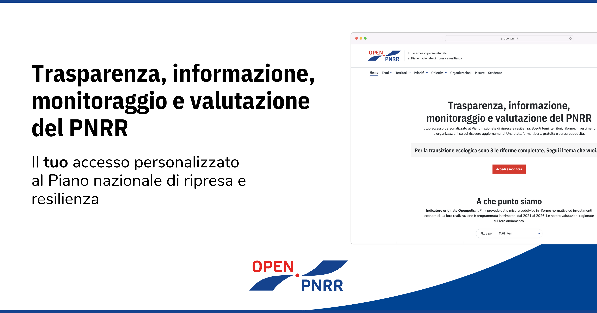

OpenPNRR ha lo scopo di monitorare e approfondire il piano nazionale di ripresa e resilienza. Offre informazioni di qualità sulla gestione, da parte del governo, delle risorse che l’Unione europea ha destinato all’Italia nell’ambito del Next generation Eu.

Il progetto – di **Fondazione Openpolis** in collaborazione con il Gran Sasso Science Institute – si pone come punto di osservazione indipendente rispetto agli annunci delle istituzioni coinvolte. Crediamo infatti che iniziative di questo tipo siano essenziali per valutare l’efficacia degli interventi, controllarne la realizzazione effettiva, contrastare il rischio di sprechi e corruzione.

➡️ <https://openpnrr.it/>

