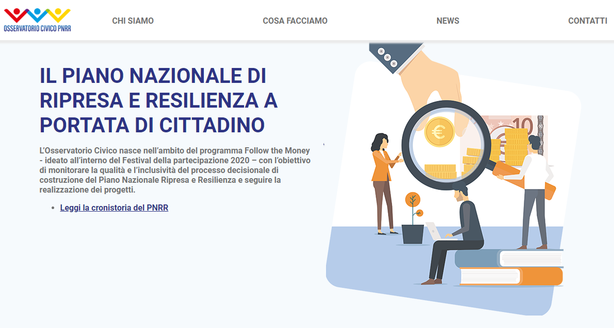

L’Osservatorio Civico nasce nell’ambito del programma Follow the Money - ideato all’interno del Festival della partecipazione 2020 – con l’obiettivo di monitorare la qualità e l’inclusività del processo decisionale di costruzione del Piano Nazionale Ripresa e Resilienza e seguire la realizzazione dei progetti.

L’Osservatorio comprende oggi alcune delle principali organizzazioni nazionali con forte esperienza nel settore della trasparenza e rendicontazione, ma ha l’intento di aprirsi anche ad altri attori con competenze tematiche più specifiche, come quelle ambientali o legate alla transizione digitale.

➡️ <https://osservatoriocivicopnrr.it/>

